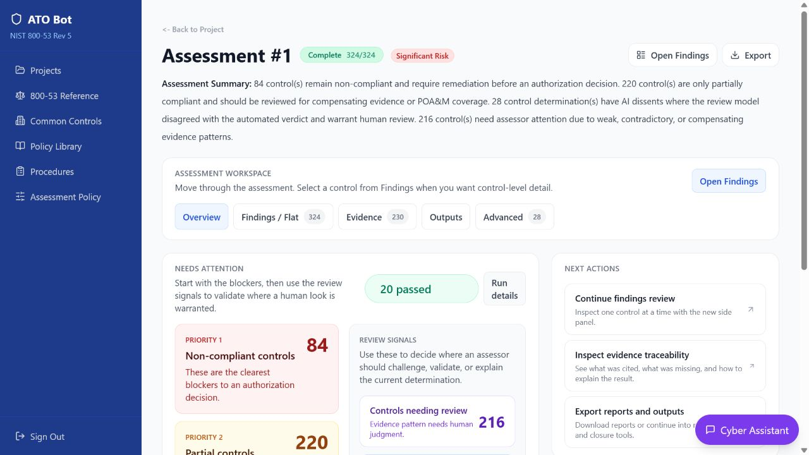
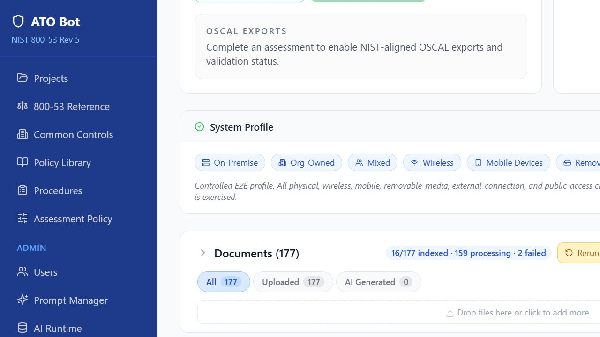
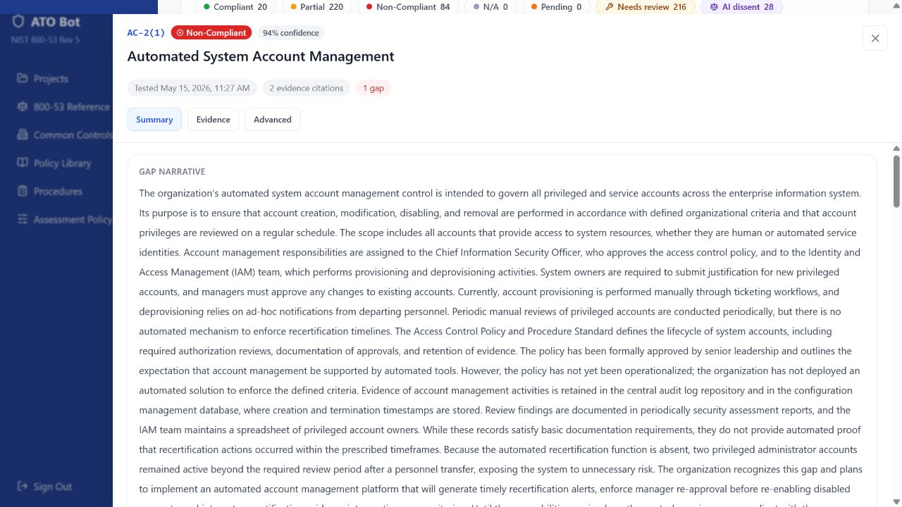
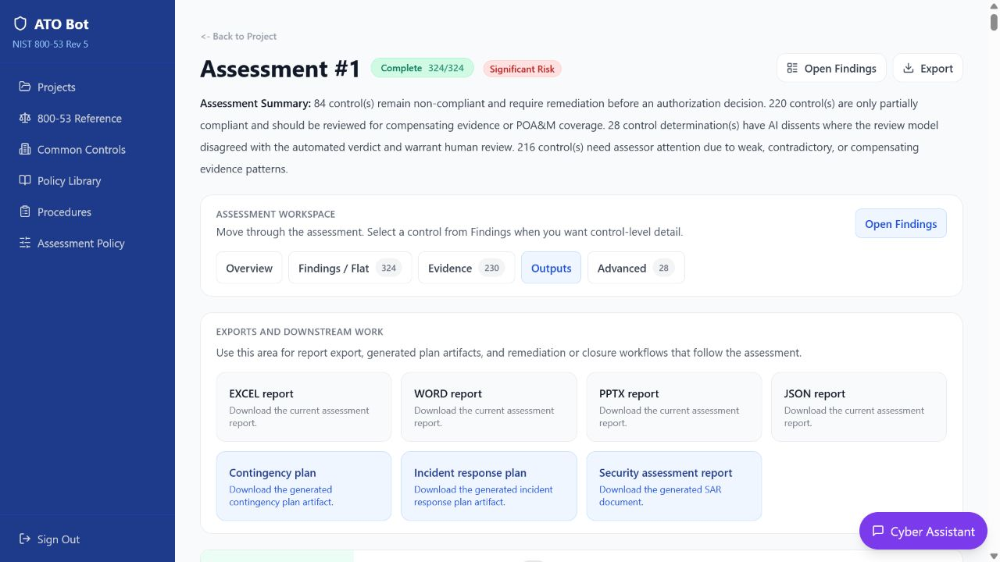

# ATO Bot

[](https://github.com/DrDeathLabs/ato-bot/actions/workflows/ci.yml)
[](https://github.com/DrDeathLabs/ato-bot/actions/workflows/security.yml)
[](https://github.com/DrDeathLabs/ato-bot/actions/workflows/release-images.yml)
[](https://github.com/DrDeathLabs/ato-bot/releases)
[](LICENSE)

ATO Bot is an AI-assisted NIST SP 800-53 assessment platform for turning fragmented system evidence into a complete, reviewable assessment workflow.

It helps assessment teams prepare evidence, evaluate control objectives, draft findings, challenge weak determinations, plan remediation, and produce assessment outputs from one governed workspace.

ATO Bot combines bounded AI reasoning with evidence provenance, structured assessment policy, deterministic control adjudication, and human review. The result is not just an AI-generated report. It is a repeatable assessment workbench that shows what evidence was used, why a control received its result, what still needs attention, and what the control owner should do next.



## AI Assessment Engine

ATO Bot applies AI to the work that makes 800-53 assessments slow and difficult: finding usable evidence, evaluating objectives, explaining gaps, and turning findings into an actionable remediation path.

### Evidence Intelligence

ATO Bot analyzes uploaded policies, procedures, plans, inventories, configurations, logs, and assessment records.

- Screens documents for relevant evidence before deeper processing.
- Classifies evidence by type, strength, and language.
- Identifies controls supported by full documents, even when the document does not use control identifiers.
- Categorizes enterprise procedures into operational libraries.
- Creates searchable evidence units with document, page, section, and source provenance.
- Connects evidence to control objectives for downstream assessment reasoning.
- Preserves citations so reviewers can trace a finding back to source material.

### Assessment Reasoning

The assessment engine evaluates evidence at the objective level instead of asking one general question about an entire control.

- Assembles objective-specific evidence packets.
- Identifies supporting, contradictory, weak, and missing evidence.
- Explains why evidence supports or fails to support an objective.
- Drafts objective narratives and control findings.
- Produces confidence and review signals for assessors.
- Generates challenge perspectives that question the first result.
- Routes the result through deterministic policy logic rather than allowing a model to set the final control status by itself.

Policy logic combines objective results, evidence quality, thresholds, overrides, and assessment rules into the control rollup. The AI contributes analysis and explanation; the assessment record remains reviewable and governed.

### Reviewer Copilot

The embedded assistant gives users context-aware help inside the assessment workspace.

- Explain a finding in plain language.
- Summarize cited evidence and source excerpts.
- Inspect an uploaded screenshot or image as review context.
- Draft assessment notes and operational rationales.
- Discuss an AI dissent without changing the verdict automatically.
- Clarify remediation expectations for a selected control.
- Help a reviewer understand what to inspect next.

The assistant is scoped to the selected project, assessment, control, evidence, or remediation context instead of operating as an ungrounded general chatbot.

### Remediation Intelligence

ATO Bot turns findings into actionable closure work for assessors, system owners, and control owners.

- Generate control-specific gap explanations.
- Identify what passing evidence must show.
- Suggest collection locations and record types.
- Conduct structured closure interviews.
- Propose remediation actions and success criteria.
- Draft operational artifacts for control-owner review.
- Re-index approved artifacts for targeted reassessment.

Generated content remains reviewable draft material until a qualified human approves it.

## Why It Is Different

Traditional assessment work is spread across document folders, spreadsheets, chat threads, evidence requests, and manually assembled reports. ATO Bot connects those activities into one assessment record.

- **Evidence-grounded:** findings connect back to source documents, excerpts, evidence units, and citations.
- **Assessment-centered:** the system evaluates NIST objectives and controls rather than simply summarizing documents.
- **AI-assisted, not AI-authoritative:** models analyze, explain, challenge, and draft; policy logic and human reviewers govern the result.
- **Reviewable:** assessors can inspect findings, evidence, gaps, confidence, dissent, activities, notes, and remediation.
- **Operational:** the workflow continues after scoring into closure guidance, POA&M work, artifact review, and reporting.
- **Repeatable:** assessment plans, evidence scope, policy configuration, runtime context, and persisted findings create a reproducible record.

## The Assessment Workspace

### Assessment Workspace

- Define the system boundary and system profile.
- Assign the FISMA System Owner.
- Create and approve assessment plans.
- Configure baselines, tailoring, inheritance, coverage, methods, objects, and depth.
- Record Examine, Interview, and Test activities.
- Review objective and control-level findings.
- Move between family and flat findings views.
- Inspect confidence, citations, gaps, dissent, notes, and review state.
- Record human challenge, override, and approval actions.

### Evidence Operations

- Maintain project, common-control, policy, and procedure libraries.
- Parse documents and monitor readiness.
- Screen and classify evidence.
- Tag evidence to controls and support semantic retrieval.
- Detect duplicates and degraded ingestion results.
- Preserve source provenance and traceability.
- Freeze the evidence scope used by an assessment run.

### Remediation and Reporting

- Open control-specific "How to Close This Gap" guidance.
- Review passing-evidence expectations.
- Follow collection guidance and recommended artifact types.
- Run closure interviews and targeted reassessments.
- Track POA&M and risk actions.
- Generate draft artifacts for review and approval.
- Produce Word, Excel, JSON, SAR-oriented, SSP-oriented, and OSCAL-oriented outputs.

## Product Tour

<table>
  <tr>
    <td width="50%">
      
      <p><strong>Define the system.</strong><br />Establish the boundary, system context, and accountable FISMA System Owner before assessment work begins.</p>
    </td>
    <td width="50%">
      
      <p><strong>Prepare evidence.</strong><br />Review parsing, classification, evidence units, provenance, duplicates, and readiness before evidence enters an assessment.</p>
    </td>
  </tr>
  <tr>
    <td width="50%">
      
      <p><strong>Run the assessment.</strong><br />See control progress, posture, review signals, evidence coverage, and the next actions for the assessment team.</p>
    </td>
    <td width="50%">
      
      <p><strong>Review the result.</strong><br />Inspect the determination, evidence, gaps, confidence, dissent, and reviewer actions for one control at a time.</p>
    </td>
  </tr>
  <tr>
    <td width="50%">
      
      <p><strong>Close the gap.</strong><br />Give control owners a concrete explanation of what is missing, what to produce, and what passing evidence must show.</p>
    </td>
    <td width="50%">
      
      <p><strong>Produce the package.</strong><br />Move reviewed findings into remediation, POA&M, and assessment reporting outputs.</p>
    </td>
  </tr>
</table>

## Who Uses ATO Bot

| Role | How ATO Bot helps |
| --- | --- |
| **Assessors** | Prepare evidence, evaluate objectives, record assessment activities, review findings, and document determinations. |
| **Reviewers** | Challenge weak results, resolve dissent, inspect provenance, approve findings, and validate final outputs. |
| **FISMA System Owners** | Understand system posture, confirm scope, assign accountability, manage risk inputs, and coordinate authorization preparation. |
| **Control Owners** | See discovered gaps, understand what evidence is missing, receive closure guidance, and submit remediation artifacts for review. |
| **Administrators** | Manage users, roles, runtime configuration, assessment policy, prompts, and audit operations. |
| **Operators** | Deploy the stack, maintain services and storage, monitor health, manage backups, and troubleshoot assessments and exports. |

## Use Cases

- Run a first-time Moderate-baseline assessment from a controlled evidence library.
- Prepare an evidence package before an assessor begins control review.
- Reassess controls after remediation and compare persisted assessment state.
- Triage findings by family, status, review signal, dissent, or evidence quality.
- Give control owners a precise handoff for closing assessment gaps.
- Record Examine, Interview, and Test activities alongside document-based analysis.
- Generate reviewable remediation drafts and assessment reporting packages.
- Support assessment-team calibration with synthetic, non-operational test data.

## How the AI Is Governed

ATO Bot keeps model behavior inside a controlled assessment workflow:

- Named runtime purposes route each AI task to an intended product behavior.
- Prompts receive scoped project, assessment, control, and evidence context.
- Structured outputs are parsed and validated before persistence.
- Evidence citations and source provenance remain attached to assessment reasoning.
- Deterministic policy logic calculates final rollups and applies overrides.
- Reviewers can inspect, challenge, resolve, override, and approve results.
- Generated artifacts are drafts until a human reviews and explicitly approves them.

ATO Bot supports qualified assessors and system owners. It does not replace assessor judgment, independently perform required interviews or technical tests, or make an authorization decision.

## Start Here

| Audience | Start with | Then read |
| --- | --- | --- |
| New user | [User Guide](docs/USER_GUIDE.md) | [Installation](docs/INSTALLATION.md) |
| Assessor or reviewer | [Assessment Operations](docs/ASSESSMENT_OPERATIONS.md) | [Assessment Workflow](docs/ASSESSMENT_WORKFLOW.md) |
| FISMA System Owner or control owner | [User Guide](docs/USER_GUIDE.md) | [Remediation and Outputs](docs/REMEDIATION_AND_OUTPUTS.md) |
| Administrator | [Administration](docs/ADMINISTRATION.md) | [Production](docs/PRODUCTION.md) |
| Operator | [Installation](docs/INSTALLATION.md) | [Troubleshooting](docs/TROUBLESHOOTING.md) |
| Developer | [Development](docs/DEVELOPMENT.md) | [Testing](docs/TESTING.md) |
| Security or release reviewer | [Threat Model](docs/THREAT_MODEL.md) | [Open Source Readiness](docs/OPEN_SOURCE_READINESS.md) |

The full documentation map and route inventory are in [docs/README.md](docs/README.md).

## Install With GHCR

Prerequisites: Docker Desktop or Docker Engine with Compose v2, persistent storage, and a configured model provider. Use a pinned release tag rather than `latest`:

```powershell
Copy-Item .env.example .env
Copy-Item backend/.env.example backend/.env
# Set strong values for every CHANGE_ME entry and configure one model provider.
$env:ATOBOT_IMAGE_TAG = "v0.1.0"
docker login ghcr.io
docker compose -f docker-compose.yml -f docker-compose.ghcr.yml pull
docker compose -f docker-compose.yml -f docker-compose.ghcr.yml up -d
docker compose ps
```

Open `http://127.0.0.1:3001`, then create an administrator using the documented administrator workflow. See [Installation](docs/INSTALLATION.md) for environment details and health validation.

## Install From Source

```powershell
Copy-Item .env.example .env
Copy-Item backend/.env.example backend/.env
docker compose up --build -d
docker compose exec backend python seed_admin.py
```

The one-shot `migrate` service runs Alembic before the API and worker start. Never expose PostgreSQL or Redis directly to an untrusted network. For TLS, reverse proxy, backups, monitoring, and upgrades, use [Production](docs/PRODUCTION.md).

## Developer Quick Start

```powershell
python -m venv backend/.venv
backend/.venv/Scripts/python -m pip install --constraint backend/constraints.txt -r backend/requirements-dev.txt
Set-Location frontend
npm ci
npm run lint
npm run build
```

Run the service stack with Docker for the closest integration environment. Backend tests, frontend checks, migration checks, and Playwright workflows are described in [Testing](docs/TESTING.md).

## Project Structure

- `backend/`: FastAPI API, worker, migrations, services, tests, uploads, and generated outputs.
- `frontend/`: React/Vite application, routes, components, and browser tests.
- `docs/`: operator, assessor, architecture, security, and release documentation.
- `docker/`: database and deployment support files.
- `docker-compose.yml`: source-build deployment.
- `docker-compose.ghcr.yml`: pinned GHCR application-image override.

## Security Boundary

Uploaded evidence, generated artifacts, model prompts, database exports, `.env` files, and runtime credentials are deployment data, not source-controlled examples. Do not commit them. ATO Bot does not guarantee that generated text is correct, complete, current, or eligible evidence; every final determination must be reviewed under the adopting organization's governance process.

## License

ATO Bot is source-available under the Business Source License 1.1. The license permits the stated internal, government, nonprofit, research, evaluation, development, testing, and personal uses while restricting hosted services, resale, and commercial third-party assessment services. Each version converts to the MIT License four years after its first public distribution.

See [LICENSE](LICENSE), [COMMERCIAL.md](COMMERCIAL.md), [NOTICE](NOTICE), [SECURITY.md](SECURITY.md), and [CONTRIBUTING.md](CONTRIBUTING.md). Use of NIST names and resources does not imply NIST endorsement.
